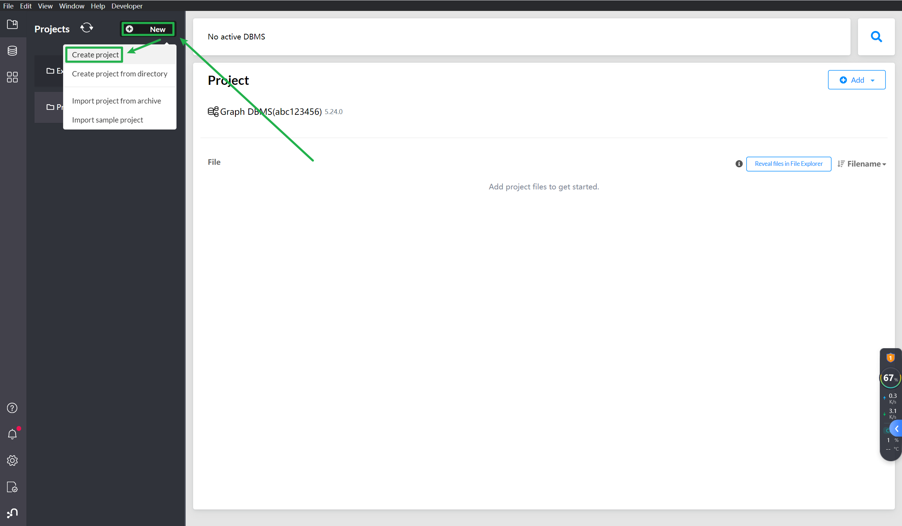
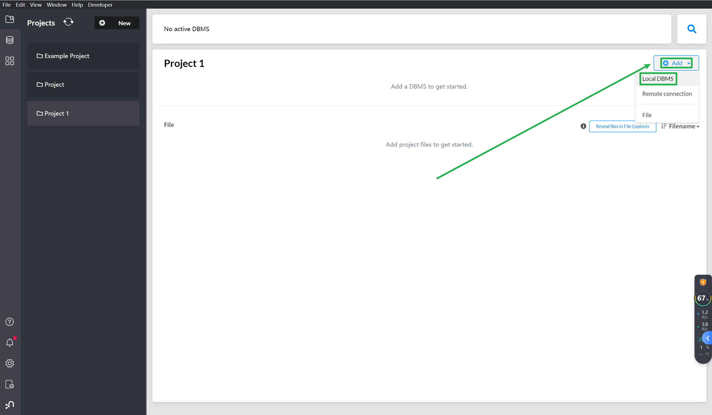
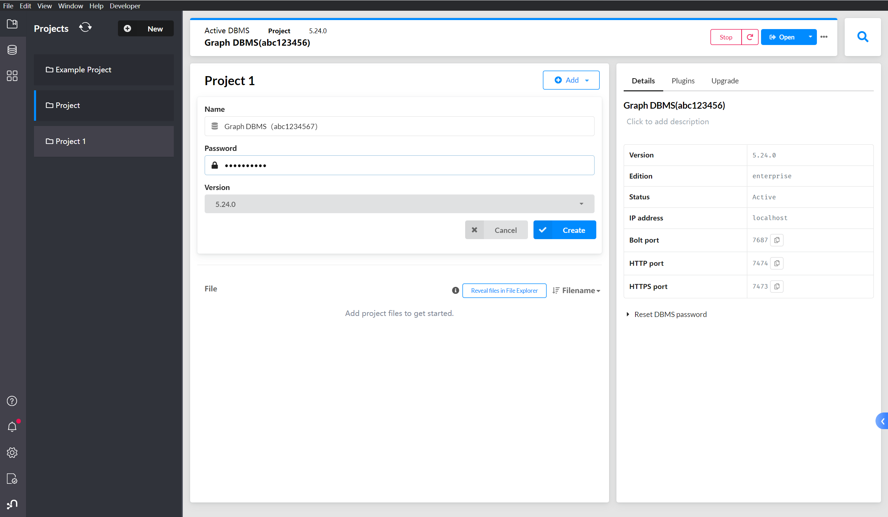
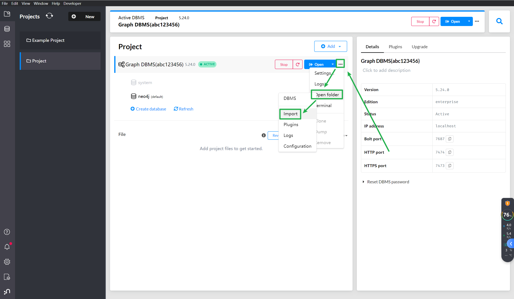
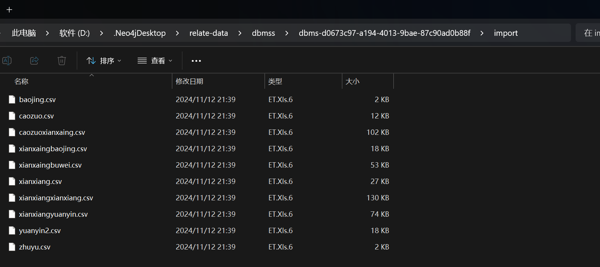
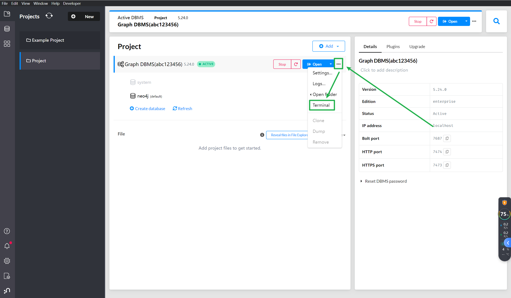
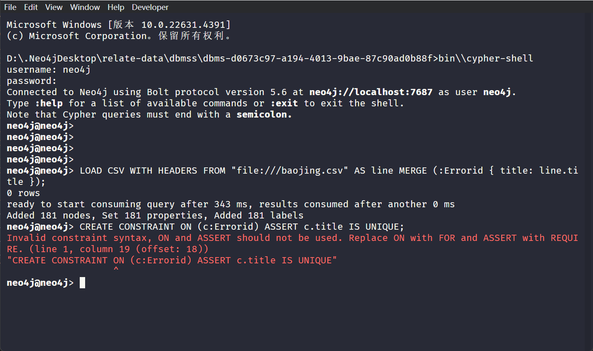
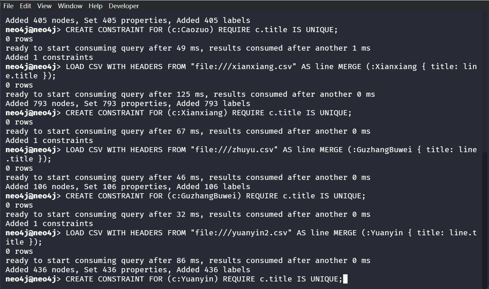

### 1 项目介绍
#### 1.1 项目来源
本项目是第八届中国软件杯大赛，基于移动端在线设备故障诊断平台的参赛作品
#### 1.2 项目要求
该项目要求从网络上爬取相关设备故障和维修解决方式，并构建知识库，当设备出现故障时，用户输入数控机床相关参数（品牌、型号、故障代码、某个或多个超出阈值参数、故障描述(文字或语音)等），系统可以根据知识库来进行故障诊断和排除，如果没有满意的方案，系统会再次进行网络爬取，如果答案有效，则对知识库进行补充和优化。
#### 1.3 项目总结
1. 构建了知识库：通过爬取数控机床维修案例，并运用自然语言处理技术（NLP）和卷积神经网络（CNN）对文本进行处理，成功地从大量文本中提取出关键故障信息，形成了初步的知识库。
2. 建立了知识图谱：利用Neo4j图数据库，我们将故障描述及其相关的操作、故障现象、故障部位、报警信号等进行了关联，形成了清晰的知识图谱，便于后续的推理和诊断。
3. 实现了故障诊断系统：该系统能够基于已构建的知识库和知识图谱，对新出现的故障描述进行分析，通过规则推理和CNN预测，诊断出最可能的故障原因，并提供给用户。
4. 实现了知识库的自学习功能：系统能够在线分析新的故障案例，通过用户反馈和语料库对比分析，对新的知识进行补充，对已有知识进行完善和优化，实现了知识库的持续更新和升级。
### 2 效果展示
### 2.1 故障诊断
- 参数含义
- pinpai：品牌
- xinghao：型号
- errorid：故障代码
- question：故障描述
- relationList：相关现象  
其中故障描述必须有，其他均可选，相关现象是在诊断出结果之后，用户反馈相关现象，再次进行诊断时用到的。多个相关现象中间用"|"分隔
```bash
curl "http://127.0.0.1:8000/qa?pinpai=发那科&xinghao=MATE-TD&errorid=ALM401&question=自动换刀时刀链运转不到位，刀库停止运转&relationList=机床自动报警"
```


```json
{
  "selectedlist": [
    "自动换刀时刀链运转不到位",
    "刀库停止运转",
    "ALM401报警",
    "机床自动报警"
  ],
  "hiddenlist": [
    "刀库开始运转",
    "但是所需要换的刀具没有传动到位",
    "刀库就停止运转了",
    "3mm后机床自动报警",
    "3min后机床自动报警",
    "CNC显示ALM411"
  ],
  "list": [
    {
      "yuanyin": "刀库停止运转的故障",
      "answer": [
        "使用时间较长,液压站的输出压力调得太高，导致联轴器的啮合齿损坏，从而当液压电动机旋转时,联轴器不能很好地传递转矩，从而产生异响。更换该联轴器后，机床恢复正常。",
        "使用时间较长,液压站的输出压力调得太高，导致联轴器的啮合齿损坏，从而当液压电动机旋转时,联轴器不能很好地传递转矩，从而产生异响。更换该联轴器后，机床恢复正常。",
        "使用时间较长,液压站的输出压力调得太高，导致联轴器的啮合齿损坏，从而当液压电动机旋转时,联轴器不能很好地传递转矩，从而产生异响。更换该联轴器后，机床恢复正常123123。",
        "使用时间较长,液压站的输出压力调得太高，导致联轴器的啮合齿损坏，从而当液压电动机旋转时,联轴器不能很好地传递转矩，从而产生异响。更换该联轴器后，机床恢复正常123123。"
      ],
      "possibility": 1.0,
      "list": [
        {
          "entity1": "自动换刀时刀链运转不到位",
          "rel": "间接原因",
          "entity2": "刀库停止运转的故障",
          "entity1_type": "现象",
          "entity2_type": "最终原因"
        },
        {
          "entity1": "刀库停止运转",
          "rel": "间接原因",
          "entity2": "刀库停止运转的故障",
          "entity1_type": "现象",
          "entity2_type": "最终原因"
        },
        {
          "entity1": "刀库停止运转的故障",
          "rel": "解决办法",
          "entity2": "使用时间较长,液压站的输出压力调得太高，导致联轴器的啮合齿损坏，从而当液压电动机旋转时,联轴器不能很好地传递转矩，从而产生异响。更换该联轴器后，机床恢复正常。",
          "entity1_type": "最终原因",
          "entity2_type": "解决办法"
        },
        {
          "entity1": "刀库停止运转的故障",
          "rel": "解决办法",
          "entity2": "使用时间较长,液压站的输出压力调得太高，导致联轴器的啮合齿损坏，从而当液压电动机旋转时,联轴器不能很好地传递转矩，从而产生异响。更换该联轴器后，机床恢复正常。",
          "entity1_type": "最终原因",
          "entity2_type": "解决办法"
        },
        {
          "entity1": "刀库停止运转的故障",
          "rel": "解决办法",
          "entity2": "使用时间较长,液压站的输出压力调得太高，导致联轴器的啮合齿损坏，从而当液压电动机旋转时,联轴器不能很好地传递转矩，从而产生异响。更换该联轴器后，机床恢复正常123123。",
          "entity1_type": "最终原因",
          "entity2_type": "解决办法"
        },
        {
          "entity1": "刀库停止运转的故障",
          "rel": "解决办法",
          "entity2": "使用时间较长,液压站的输出压力调得太高，导致联轴器的啮合齿损坏，从而当液压电动机旋转时,联轴器不能很好地传递转矩，从而产生异响。更换该联轴器后，机床恢复正常123123。",
          "entity1_type": "最终原因",
          "entity2_type": "解决办法"
        }
      ]
    },
    {
      "yuanyin": "连接不良引起跟随误差报警的故障",
      "answer": [
        "FANUC 6M系统ALM401报警的内容同前,ALM411报警的含义是 \"运动时X轴跟随误差超过”\r\n进一步分析、试验，发现系统全部参数设置正确，开机时驱动器无报警，且利用增量 方式或手轮方式少量移动X轴（!0.2mm）,机床仍无报警，且显示变化，但电动机不转。 通过诊断参数检查X轴跟随误差DGN800的值,发现在X轴运动时，其值不断增加，当 超过±200时，即出现报警，这一点与系统的''停止时允差”监控参数一致。\r\n由于机床开机时速度控制单元均无报警，且CNC跟随误差能变化，初步判定机床的 CNC与速度控制单元均无故障。利用万用表测量驱动器的！CMD（速度给定电压）输入, 发现此值始终为“5”,即：故障原因为CNC的速度给定电压未输入到驱动器。\r\n在故障确定后，检查CNC至速度控制单元的连线，发现X轴速度给定输出线中间已 断裂;重新连接后，故障排除,X轴即可正常工作。\r\n",
        "test1"
      ],
      "possibility": 0.5,
      "list": [
        {
          "entity1": "ALM401报警",
          "rel": "间接原因",
          "entity2": "连接不良引起跟随误差报警的故障",
          "entity1_type": "现象",
          "entity2_type": "最终原因"
        },
        {
          "entity1": "连接不良引起跟随误差报警的故障",
          "rel": "解决办法",
          "entity2": "FANUC 6M系统ALM401报警的内容同前,ALM411报警的含义是 \"运动时X轴跟随误差超过”\r\n进一步分析、试验，发现系统全部参数设置正确，开机时驱动器无报警，且利用增量 方式或手轮方式少量移动X轴（!0.2mm）,机床仍无报警，且显示变化，但电动机不转。 通过诊断参数检查X轴跟随误差DGN800的值,发现在X轴运动时，其值不断增加，当 超过±200时，即出现报警，这一点与系统的''停止时允差”监控参数一致。\r\n由于机床开机时速度控制单元均无报警，且CNC跟随误差能变化，初步判定机床的 CNC与速度控制单元均无故障。利用万用表测量驱动器的！CMD（速度给定电压）输入, 发现此值始终为“5”,即：故障原因为CNC的速度给定电压未输入到驱动器。\r\n在故障确定后，检查CNC至速度控制单元的连线，发现X轴速度给定输出线中间已 断裂;重新连接后，故障排除,X轴即可正常工作。\r\n",
          "entity1_type": "最终原因",
          "entity2_type": "解决办法"
        },
        {
          "entity1": "连接不良引起跟随误差报警的故障",
          "rel": "解决办法",
          "entity2": "test1",
          "entity1_type": "最终原因",
          "entity2_type": "解决办法"
        }
      ]
    },
    {
      "yuanyin": "刀库无法旋转的故障",
      "answer": [
        "TH42160龙门加工中心采用的链式刀库如图8-20所示,其配套 的 CNC 系统为 SIEMENS840D。\r\n由上达故障查报警知道是换刀时间超出。此时在MDI方式中，无论用手动输入刀 库顺时针旋转还是逆时针旋转动作指令，刀库均不动作。检查电气控制系统，没有发现 什么异常;PLC输出指示器上的发光二极管燃亮，表明PL2有输出，那么问题应该发生 在机械传动方面。估计故障可能出在减速器上。为此,拆除了防护罩，卸下了伺服电动 机，拆开减速器，发现减速器内一传动轴上的联接键脱落，致使动力传动路线中断，刀库 无法旋转。修复减速器后，故障排除。\r\n",
        "TH42160龙门加工中心采用的链式刀库如图8-20所示,其配套 的 CNC 系统为 SIEMENS 840D。\r\n由上达故障查报警知道是刀库伺服电动机过载。检查电气控制系统，没有发现什 么异常，问题应该发生在机械传动或其他方面:①刀库链或减速器内有异物卡住；②刀 库链上的刀具太重;③润滑不良；经过检查上达三项正常。卸下伺服电动机，发现伺服 电动机内部有许多切削液,致使线圈短路所致。观察原因是电动机与减速器联接处的 密封圈磨损，从而导致切削液渗入电动机。更换密封圈和伺服电动机后，故障排除。\r\n"
      ],
      "possibility": 0.38,
      "list": [
        {
          "entity1": "自动换刀时刀链运转不到位",
          "rel": "间接原因",
          "entity2": "刀库无法旋转的故障",
          "entity1_type": "现象",
          "entity2_type": "最终原因"
        },
        {
          "entity1": "自动换刀时刀链运转不到位",
          "rel": "间接原因",
          "entity2": "刀库无法旋转的故障",
          "entity1_type": "现象",
          "entity2_type": "最终原因"
        },
        {
          "entity1": "机床自动报警",
          "rel": "间接原因",
          "entity2": "刀库无法旋转的故障",
          "entity1_type": "现象",
          "entity2_type": "最终原因"
        },
        {
          "entity1": "刀库无法旋转的故障",
          "rel": "解决办法",
          "entity2": "TH42160龙门加工中心采用的链式刀库如图8-20所示,其配套 的 CNC 系统为 SIEMENS840D。\r\n由上达故障查报警知道是换刀时间超出。此时在MDI方式中，无论用手动输入刀 库顺时针旋转还是逆时针旋转动作指令，刀库均不动作。检查电气控制系统，没有发现 什么异常;PLC输出指示器上的发光二极管燃亮，表明PL2有输出，那么问题应该发生 在机械传动方面。估计故障可能出在减速器上。为此,拆除了防护罩，卸下了伺服电动 机，拆开减速器，发现减速器内一传动轴上的联接键脱落，致使动力传动路线中断，刀库 无法旋转。修复减速器后，故障排除。\r\n",
          "entity1_type": "最终原因",
          "entity2_type": "解决办法"
        },
        {
          "entity1": "刀库无法旋转的故障",
          "rel": "解决办法",
          "entity2": "TH42160龙门加工中心采用的链式刀库如图8-20所示,其配套 的 CNC 系统为 SIEMENS 840D。\r\n由上达故障查报警知道是刀库伺服电动机过载。检查电气控制系统，没有发现什 么异常，问题应该发生在机械传动或其他方面:①刀库链或减速器内有异物卡住；②刀 库链上的刀具太重;③润滑不良；经过检查上达三项正常。卸下伺服电动机，发现伺服 电动机内部有许多切削液,致使线圈短路所致。观察原因是电动机与减速器联接处的 密封圈磨损，从而导致切削液渗入电动机。更换密封圈和伺服电动机后，故障排除。\r\n",
          "entity1_type": "最终原因",
          "entity2_type": "解决办法"
        }
      ]
    },
    {
      "yuanyin": "换刀不到位的故障",
      "answer": [
        "MPA - H100A加工中心是日本三菱公司广岛工机工厂生产，所配 CNC系统为FANUC 6M - MODELB,工作台为10001000mm x 1000mm,60把刀具。由上达 故障查报警知道是换刀时间超出。此时在MDI方式中，无论用手动输入刀库顺时针旋 转还是逆时针旋转动作指令，刀库均不动作。检查电气控制系统，没有发现什么异常; PLC输出指示器上的发光二极管燃亮，表明PLC有输出，刀库顺时针和边时针传动电磁 阀上的逆时针一侧的发光二极管燃亮，表明电磁阀有电，此时刀库不动作，那么问题应 该发生在液压系统或者其他方面。但是液压系统的压力正常，各油路均畅通并无堵塞 现象;检查各个液压阀的液压器件也没有发现什么问题，估计故障可能出在液压马达 上。为此,拆除了防护罩，卸下了液压马达，能拆卸检查的部位，都作了检查，也没有发 现什么问题;后又将液压马达送到大连组合机床研究所去鉴定，其测试结论是液压马达 是完好的。经在场的同志们仔细分析研究后认为，问题只能有一个，那就是机械方面的 故障;但刀库的各部位，各个零部件均无明显的损伤痕迹，因此机械损坏故障可排除在 外;最后问题归结为一点，即刀库负载太重，或者有阻滞的部位，以至液压马达带不动所 致。\r\n事实上的确如此。我们在加工10t叉车箱体时，由于工件较复杂，加工面较多，所用 刀具多达40多把，而且大的刀具,长的刀具（最长的刀具达550mm）,重的刀具（最重的刀 具达25kg以上）用量都很大，而且我们忽略了刀具在刀库上的分布情况,重而长的刀具 在刀库上没有均匀分布，而是集中于一段，以至造成刀库的链带局部拉得太紧,变形较 大,并且可能有阻滞现象，所以机床的液压马达带不动。最后我们把刀库链带的可调部 分稍松了一些，结果一切都恢复正常，说明问题的确是出在机械上。\r\n注意:刀库的链带又不能调得太松，否则会有''飞刀”的危险。有一次机械手在刀库 侧抓刀时，当把刀具拔出、然后上升、再进行180。旋转时，刀具突然被甩出，险些酿成大 祸。分析这起故障的原因，就是因为刀库链带太松的缘故。该机床机械手的两个卡爪 是靠向下的推力而被刀柄的外径向外挤开，然后靠弹簧的张力来夹紧刀具的。当机械 手向下抓刀时，由于链带太松,链带也随着机械手向下的推力而向下拱曲，结果机械手 的卡爪只抓住刀柄的一大半，并没有完全抓靠、抓牢，当机械手旋转时，由于刀具很重, 在离心力的作用下，刀具就沿切线方向甩出去。经把链带稍微紧了一下，就再也没有发 生类似情况。\r\n"
      ],
      "possibility": 0.2,
      "list": [
        {
          "entity1": "自动换刀时刀链运转不到位",
          "rel": "间接原因",
          "entity2": "换刀不到位的故障",
          "entity1_type": "现象",
          "entity2_type": "最终原因"
        },
        {
          "entity1": "换刀不到位的故障",
          "rel": "解决办法",
          "entity2": "MPA - H100A加工中心是日本三菱公司广岛工机工厂生产，所配 CNC系统为FANUC 6M - MODELB,工作台为10001000mm x 1000mm,60把刀具。由上达 故障查报警知道是换刀时间超出。此时在MDI方式中，无论用手动输入刀库顺时针旋 转还是逆时针旋转动作指令，刀库均不动作。检查电气控制系统，没有发现什么异常; PLC输出指示器上的发光二极管燃亮，表明PLC有输出，刀库顺时针和边时针传动电磁 阀上的逆时针一侧的发光二极管燃亮，表明电磁阀有电，此时刀库不动作，那么问题应 该发生在液压系统或者其他方面。但是液压系统的压力正常，各油路均畅通并无堵塞 现象;检查各个液压阀的液压器件也没有发现什么问题，估计故障可能出在液压马达 上。为此,拆除了防护罩，卸下了液压马达，能拆卸检查的部位，都作了检查，也没有发 现什么问题;后又将液压马达送到大连组合机床研究所去鉴定，其测试结论是液压马达 是完好的。经在场的同志们仔细分析研究后认为，问题只能有一个，那就是机械方面的 故障;但刀库的各部位，各个零部件均无明显的损伤痕迹，因此机械损坏故障可排除在 外;最后问题归结为一点，即刀库负载太重，或者有阻滞的部位，以至液压马达带不动所 致。\r\n事实上的确如此。我们在加工10t叉车箱体时，由于工件较复杂，加工面较多，所用 刀具多达40多把，而且大的刀具,长的刀具（最长的刀具达550mm）,重的刀具（最重的刀 具达25kg以上）用量都很大，而且我们忽略了刀具在刀库上的分布情况,重而长的刀具 在刀库上没有均匀分布，而是集中于一段，以至造成刀库的链带局部拉得太紧,变形较 大,并且可能有阻滞现象，所以机床的液压马达带不动。最后我们把刀库链带的可调部 分稍松了一些，结果一切都恢复正常，说明问题的确是出在机械上。\r\n注意:刀库的链带又不能调得太松，否则会有''飞刀”的危险。有一次机械手在刀库 侧抓刀时，当把刀具拔出、然后上升、再进行180。旋转时，刀具突然被甩出，险些酿成大 祸。分析这起故障的原因，就是因为刀库链带太松的缘故。该机床机械手的两个卡爪 是靠向下的推力而被刀柄的外径向外挤开，然后靠弹簧的张力来夹紧刀具的。当机械 手向下抓刀时，由于链带太松,链带也随着机械手向下的推力而向下拱曲，结果机械手 的卡爪只抓住刀柄的一大半，并没有完全抓靠、抓牢，当机械手旋转时，由于刀具很重, 在离心力的作用下，刀具就沿切线方向甩出去。经把链带稍微紧了一下，就再也没有发 生类似情况。\r\n",
          "entity1_type": "最终原因",
          "entity2_type": "解决办法"
        }
      ]
    }
  ]
}
```
### 2.2 在线分析
在线分析接口参数同故障诊断
```bash
curl "http://127.0.0.1:8000/pa?pinpai=发那科&xinghao=MATE-TD&errorid=ALM401&question=自动换刀时刀链运转不到位，刀库停止运转&relationList=机床自动报警"
```


```json
{
  "simple_url": [
    
  ],
  "answer": [
    {
      "answer": "首先检查气液转换的气源压力正常,检查工作台压紧液压缸油位 指示杆，已到上限，可能缺油，用螺钉旋具拧工作台上升、下落电磁阀手动钮，让工作台 压紧气液转换缸补油，油位指示杆回到中间位置，报警消除。但过半小时左右，报警又 出现,再查压紧液压缸油位，又缺油，故怀疑油路有泄漏。查油管各接头正常，怀疑对象 缩小为工作台夹紧工作液压缸和夹紧气液转换缸，查气液转换缸，发现油腔端Y形聚胺 酯密封有裂纹，导致压力油慢慢回流到补油腔，最后因油不够不能形成油压而报警，更 换后故障排除。",
      "zan": 10
    },
    {
      "answer": "现场观察，主轴处于非定向状态，可以断定换刀过程中，定向偏 移,卡住;而根据报警号分析，说明主轴试图恢复到定向位置，但因卡住面报警关机。手 动操作电磁闹分别将主轴刀具松开，刀库伸出，手工将刀爪上的刀卸下，再手动将主轴 夹紧，刀库退回；开机，报警消除。为查找原因，检查刀库刀爪与主轴相对位置，发现刀 库刀爪偏左，主轴换刀后下移时刀爪右指刮擦刀柄，造成主轴顺时针转动偏离定向，而 主轴默认定向为M19,恢复定向旋转方向与偏离方向一致，更加大了这一偏离，因而偏 离很多造成卡死;而主轴上移时，刀爪右指刮擦使刀柄逆转，而M19定向为正转正好将 其消除，不存在这一问题。调整刀库四零位置参数7508,使刀爪与主轴对齐后，故障消除。",
      "zan": 8
    },
    {
      "answer": "使用时间较长, 液压站的输出压力调得太高，导致联轴器的啮合齿损坏，从而当液压电动机旋转时，联 轴器不能很好地传递转矩，从而产生异响。更换该联轴器后，机床恢复正常。",
      "zan": 6
    }
  ]
}
```
### 2.3 问答
基于知识图谱，目前支持四类问题的问答
- 某故障原因会引起哪些现象？
- 执行某操作时会遇到哪些错误？
- 某部位常发生的故障有哪些？
- 某故障报警的含义是什么？  
```bash
curl "http://127.0.0.1:8000/wenda?question=外部24V短路的故障会引起哪些现象"
```

```json
{
  "answer": [
    "无法重新起动机床报警",
    "机床突然断电报警",
    "F14报警"
  ]
}
```
### 2.4 反馈

```bash
curl "http://127.0.0.1:8000/save?pinpai=发那科&xinghao=MATE-TD&errorid=ALM401&question=自动换刀时刀链运转不到位，刀库停止运转&relationList=机床自动报警&answer=test使用时间较长,液压站的输出压力调得太高，导致联轴器的啮合齿损坏，从而当液压电动机旋转时,联轴器不能很好地传递转矩，从而产生异响。更换该联轴器后，机床恢复正常。"
```

```json
{
  "message": "保存成功"
}
```

>再次访问故障诊断接口： http://127.0.0.1:8000/qa?pinpai=发那科&xinghao=MATE-TD&errorid=ALM401&question=自动换刀时刀链运转不到位，刀库停止运转&relationList=机床自动报警
```json
{
  "selectedlist": [
    "自动换刀时刀链运转不到位",
    "刀库停止运转",
    "ALM401报警",
    "机床自动报警"
  ],
  "hiddenlist": [
    "刀库开始运转",
    "但是所需要换的刀具没有传动到位",
    "刀库就停止运转了",
    "3mm后机床自动报警",
    "3min后机床自动报警",
    "CNC显示ALM411"
  ],
  "list": [
    {
      "yuanyin": "刀库停止运转的故障",
      "answer": [
        "使用时间较长,液压站的输出压力调得太高，导致联轴器的啮合齿损坏，从而当液压电动机旋转时,联轴器不能很好地传递转矩，从而产生异响。更换该联轴器后，机床恢复正常。",
        "test使用时间较长,液压站的输出压力调得太高，导致联轴器的啮合齿损坏，从而当液压电动机旋转时,联轴器不能很好地传递转矩，从而产生异响。更换该联轴器后，机床恢复正常。"
      ],
      "possibility": 1.0,
      "list": [
        {
          "entity1": "自动换刀时刀链运转不到位",
          "rel": "间接原因",
          "entity2": "刀库停止运转的故障",
          "entity1_type": "现象",
          "entity2_type": "最终原因"
        },
        {
          "entity1": "刀库停止运转",
          "rel": "间接原因",
          "entity2": "刀库停止运转的故障",
          "entity1_type": "现象",
          "entity2_type": "最终原因"
        },
        {
          "entity1": "刀库停止运转的故障",
          "rel": "解决办法",
          "entity2": "使用时间较长,液压站的输出压力调得太高，导致联轴器的啮合齿损坏，从而当液压电动机旋转时,联轴器不能很好地传递转矩，从而产生异响。更换该联轴器后，机床恢复正常。",
          "entity1_type": "最终原因",
          "entity2_type": "解决办法"
        },
        {
          "entity1": "刀库停止运转的故障",
          "rel": "解决办法",
          "entity2": "使用时间较长,液压站的输出压力调得太高，导致联轴器的啮合齿损坏，从而当液压电动机旋转时,联轴器不能很好地传递转矩，从而产生异响。更换该联轴器后，机床恢复正常。",
          "entity1_type": "最终原因",
          "entity2_type": "解决办法"
        },
        {
          "entity1": "刀库停止运转的故障",
          "rel": "解决办法",
          "entity2": "使用时间较长,液压站的输出压力调得太高，导致联轴器的啮合齿损坏，从而当液压电动机旋转时,联轴器不能很好地传递转矩，从而产生异响。更换该联轴器后，机床恢复正常123123。",
          "entity1_type": "最终原因",
          "entity2_type": "解决办法"
        },
        {
          "entity1": "刀库停止运转的故障",
          "rel": "解决办法",
          "entity2": "使用时间较长,液压站的输出压力调得太高，导致联轴器的啮合齿损坏，从而当液压电动机旋转时,联轴器不能很好地传递转矩，从而产生异响。更换该联轴器后，机床恢复正常123123。",
          "entity1_type": "最终原因",
          "entity2_type": "解决办法"
        },
        {
          "entity1": "刀库停止运转的故障",
          "rel": "解决办法",
          "entity2": "test使用时间较长,液压站的输出压力调得太高，导致联轴器的啮合齿损坏，从而当液压电动机旋转时,联轴器不能很好地传递转矩，从而产生异响。更换该联轴器后，机床恢复正常。",
          "entity1_type": "最终原因",
          "entity2_type": "解决办法"
        },
        {
          "entity1": "刀库停止运转的故障",
          "rel": "解决办法",
          "entity2": "test使用时间较长,液压站的输出压力调得太高，导致联轴器的啮合齿损坏，从而当液压电动机旋转时,联轴器不能很好地传递转矩，从而产生异响。更换该联轴器后，机床恢复正常。",
          "entity1_type": "最终原因",
          "entity2_type": "解决办法"
        }
      ]
    },
    {
      "yuanyin": "连接不良引起跟随误差报警的故障",
      "answer": [
        "FANUC 6M系统ALM401报警的内容同前,ALM411报警的含义是 \"运动时X轴跟随误差超过”\r\n进一步分析、试验，发现系统全部参数设置正确，开机时驱动器无报警，且利用增量 方式或手轮方式少量移动X轴（!0.2mm）,机床仍无报警，且显示变化，但电动机不转。 通过诊断参数检查X轴跟随误差DGN800的值,发现在X轴运动时，其值不断增加，当 超过±200时，即出现报警，这一点与系统的''停止时允差”监控参数一致。\r\n由于机床开机时速度控制单元均无报警，且CNC跟随误差能变化，初步判定机床的 CNC与速度控制单元均无故障。利用万用表测量驱动器的！CMD（速度给定电压）输入, 发现此值始终为“5”,即：故障原因为CNC的速度给定电压未输入到驱动器。\r\n在故障确定后，检查CNC至速度控制单元的连线，发现X轴速度给定输出线中间已 断裂;重新连接后，故障排除,X轴即可正常工作。\r\n",
        "test1"
      ],
      "possibility": 0.5,
      "list": [
        {
          "entity1": "ALM401报警",
          "rel": "间接原因",
          "entity2": "连接不良引起跟随误差报警的故障",
          "entity1_type": "现象",
          "entity2_type": "最终原因"
        },
        {
          "entity1": "连接不良引起跟随误差报警的故障",
          "rel": "解决办法",
          "entity2": "FANUC 6M系统ALM401报警的内容同前,ALM411报警的含义是 \"运动时X轴跟随误差超过”\r\n进一步分析、试验，发现系统全部参数设置正确，开机时驱动器无报警，且利用增量 方式或手轮方式少量移动X轴（!0.2mm）,机床仍无报警，且显示变化，但电动机不转。 通过诊断参数检查X轴跟随误差DGN800的值,发现在X轴运动时，其值不断增加，当 超过±200时，即出现报警，这一点与系统的''停止时允差”监控参数一致。\r\n由于机床开机时速度控制单元均无报警，且CNC跟随误差能变化，初步判定机床的 CNC与速度控制单元均无故障。利用万用表测量驱动器的！CMD（速度给定电压）输入, 发现此值始终为“5”,即：故障原因为CNC的速度给定电压未输入到驱动器。\r\n在故障确定后，检查CNC至速度控制单元的连线，发现X轴速度给定输出线中间已 断裂;重新连接后，故障排除,X轴即可正常工作。\r\n",
          "entity1_type": "最终原因",
          "entity2_type": "解决办法"
        },
        {
          "entity1": "连接不良引起跟随误差报警的故障",
          "rel": "解决办法",
          "entity2": "test1",
          "entity1_type": "最终原因",
          "entity2_type": "解决办法"
        }
      ]
    },
    {
      "yuanyin": "刀库无法旋转的故障",
      "answer": [
        "TH42160龙门加工中心采用的链式刀库如图8-20所示,其配套 的 CNC 系统为 SIEMENS840D。\r\n由上达故障查报警知道是换刀时间超出。此时在MDI方式中，无论用手动输入刀 库顺时针旋转还是逆时针旋转动作指令，刀库均不动作。检查电气控制系统，没有发现 什么异常;PLC输出指示器上的发光二极管燃亮，表明PL2有输出，那么问题应该发生 在机械传动方面。估计故障可能出在减速器上。为此,拆除了防护罩，卸下了伺服电动 机，拆开减速器，发现减速器内一传动轴上的联接键脱落，致使动力传动路线中断，刀库 无法旋转。修复减速器后，故障排除。\r\n",
        "TH42160龙门加工中心采用的链式刀库如图8-20所示,其配套 的 CNC 系统为 SIEMENS 840D。\r\n由上达故障查报警知道是刀库伺服电动机过载。检查电气控制系统，没有发现什 么异常，问题应该发生在机械传动或其他方面:①刀库链或减速器内有异物卡住；②刀 库链上的刀具太重;③润滑不良；经过检查上达三项正常。卸下伺服电动机，发现伺服 电动机内部有许多切削液,致使线圈短路所致。观察原因是电动机与减速器联接处的 密封圈磨损，从而导致切削液渗入电动机。更换密封圈和伺服电动机后，故障排除。\r\n"
      ],
      "possibility": 0.38,
      "list": [
        {
          "entity1": "自动换刀时刀链运转不到位",
          "rel": "间接原因",
          "entity2": "刀库无法旋转的故障",
          "entity1_type": "现象",
          "entity2_type": "最终原因"
        },
        {
          "entity1": "自动换刀时刀链运转不到位",
          "rel": "间接原因",
          "entity2": "刀库无法旋转的故障",
          "entity1_type": "现象",
          "entity2_type": "最终原因"
        },
        {
          "entity1": "机床自动报警",
          "rel": "间接原因",
          "entity2": "刀库无法旋转的故障",
          "entity1_type": "现象",
          "entity2_type": "最终原因"
        },
        {
          "entity1": "刀库无法旋转的故障",
          "rel": "解决办法",
          "entity2": "TH42160龙门加工中心采用的链式刀库如图8-20所示,其配套 的 CNC 系统为 SIEMENS840D。\r\n由上达故障查报警知道是换刀时间超出。此时在MDI方式中，无论用手动输入刀 库顺时针旋转还是逆时针旋转动作指令，刀库均不动作。检查电气控制系统，没有发现 什么异常;PLC输出指示器上的发光二极管燃亮，表明PL2有输出，那么问题应该发生 在机械传动方面。估计故障可能出在减速器上。为此,拆除了防护罩，卸下了伺服电动 机，拆开减速器，发现减速器内一传动轴上的联接键脱落，致使动力传动路线中断，刀库 无法旋转。修复减速器后，故障排除。\r\n",
          "entity1_type": "最终原因",
          "entity2_type": "解决办法"
        },
        {
          "entity1": "刀库无法旋转的故障",
          "rel": "解决办法",
          "entity2": "TH42160龙门加工中心采用的链式刀库如图8-20所示,其配套 的 CNC 系统为 SIEMENS 840D。\r\n由上达故障查报警知道是刀库伺服电动机过载。检查电气控制系统，没有发现什 么异常，问题应该发生在机械传动或其他方面:①刀库链或减速器内有异物卡住；②刀 库链上的刀具太重;③润滑不良；经过检查上达三项正常。卸下伺服电动机，发现伺服 电动机内部有许多切削液,致使线圈短路所致。观察原因是电动机与减速器联接处的 密封圈磨损，从而导致切削液渗入电动机。更换密封圈和伺服电动机后，故障排除。\r\n",
          "entity1_type": "最终原因",
          "entity2_type": "解决办法"
        }
      ]
    },
    {
      "yuanyin": "换刀不到位的故障",
      "answer": [
        "MPA - H100A加工中心是日本三菱公司广岛工机工厂生产，所配 CNC系统为FANUC 6M - MODELB,工作台为10001000mm x 1000mm,60把刀具。由上达 故障查报警知道是换刀时间超出。此时在MDI方式中，无论用手动输入刀库顺时针旋 转还是逆时针旋转动作指令，刀库均不动作。检查电气控制系统，没有发现什么异常; PLC输出指示器上的发光二极管燃亮，表明PLC有输出，刀库顺时针和边时针传动电磁 阀上的逆时针一侧的发光二极管燃亮，表明电磁阀有电，此时刀库不动作，那么问题应 该发生在液压系统或者其他方面。但是液压系统的压力正常，各油路均畅通并无堵塞 现象;检查各个液压阀的液压器件也没有发现什么问题，估计故障可能出在液压马达 上。为此,拆除了防护罩，卸下了液压马达，能拆卸检查的部位，都作了检查，也没有发 现什么问题;后又将液压马达送到大连组合机床研究所去鉴定，其测试结论是液压马达 是完好的。经在场的同志们仔细分析研究后认为，问题只能有一个，那就是机械方面的 故障;但刀库的各部位，各个零部件均无明显的损伤痕迹，因此机械损坏故障可排除在 外;最后问题归结为一点，即刀库负载太重，或者有阻滞的部位，以至液压马达带不动所 致。\r\n事实上的确如此。我们在加工10t叉车箱体时，由于工件较复杂，加工面较多，所用 刀具多达40多把，而且大的刀具,长的刀具（最长的刀具达550mm）,重的刀具（最重的刀 具达25kg以上）用量都很大，而且我们忽略了刀具在刀库上的分布情况,重而长的刀具 在刀库上没有均匀分布，而是集中于一段，以至造成刀库的链带局部拉得太紧,变形较 大,并且可能有阻滞现象，所以机床的液压马达带不动。最后我们把刀库链带的可调部 分稍松了一些，结果一切都恢复正常，说明问题的确是出在机械上。\r\n注意:刀库的链带又不能调得太松，否则会有''飞刀”的危险。有一次机械手在刀库 侧抓刀时，当把刀具拔出、然后上升、再进行180。旋转时，刀具突然被甩出，险些酿成大 祸。分析这起故障的原因，就是因为刀库链带太松的缘故。该机床机械手的两个卡爪 是靠向下的推力而被刀柄的外径向外挤开，然后靠弹簧的张力来夹紧刀具的。当机械 手向下抓刀时，由于链带太松,链带也随着机械手向下的推力而向下拱曲，结果机械手 的卡爪只抓住刀柄的一大半，并没有完全抓靠、抓牢，当机械手旋转时，由于刀具很重, 在离心力的作用下，刀具就沿切线方向甩出去。经把链带稍微紧了一下，就再也没有发 生类似情况。\r\n"
      ],
      "possibility": 0.2,
      "list": [
        {
          "entity1": "自动换刀时刀链运转不到位",
          "rel": "间接原因",
          "entity2": "换刀不到位的故障",
          "entity1_type": "现象",
          "entity2_type": "最终原因"
        },
        {
          "entity1": "换刀不到位的故障",
          "rel": "解决办法",
          "entity2": "MPA - H100A加工中心是日本三菱公司广岛工机工厂生产，所配 CNC系统为FANUC 6M - MODELB,工作台为10001000mm x 1000mm,60把刀具。由上达 故障查报警知道是换刀时间超出。此时在MDI方式中，无论用手动输入刀库顺时针旋 转还是逆时针旋转动作指令，刀库均不动作。检查电气控制系统，没有发现什么异常; PLC输出指示器上的发光二极管燃亮，表明PLC有输出，刀库顺时针和边时针传动电磁 阀上的逆时针一侧的发光二极管燃亮，表明电磁阀有电，此时刀库不动作，那么问题应 该发生在液压系统或者其他方面。但是液压系统的压力正常，各油路均畅通并无堵塞 现象;检查各个液压阀的液压器件也没有发现什么问题，估计故障可能出在液压马达 上。为此,拆除了防护罩，卸下了液压马达，能拆卸检查的部位，都作了检查，也没有发 现什么问题;后又将液压马达送到大连组合机床研究所去鉴定，其测试结论是液压马达 是完好的。经在场的同志们仔细分析研究后认为，问题只能有一个，那就是机械方面的 故障;但刀库的各部位，各个零部件均无明显的损伤痕迹，因此机械损坏故障可排除在 外;最后问题归结为一点，即刀库负载太重，或者有阻滞的部位，以至液压马达带不动所 致。\r\n事实上的确如此。我们在加工10t叉车箱体时，由于工件较复杂，加工面较多，所用 刀具多达40多把，而且大的刀具,长的刀具（最长的刀具达550mm）,重的刀具（最重的刀 具达25kg以上）用量都很大，而且我们忽略了刀具在刀库上的分布情况,重而长的刀具 在刀库上没有均匀分布，而是集中于一段，以至造成刀库的链带局部拉得太紧,变形较 大,并且可能有阻滞现象，所以机床的液压马达带不动。最后我们把刀库链带的可调部 分稍松了一些，结果一切都恢复正常，说明问题的确是出在机械上。\r\n注意:刀库的链带又不能调得太松，否则会有''飞刀”的危险。有一次机械手在刀库 侧抓刀时，当把刀具拔出、然后上升、再进行180。旋转时，刀具突然被甩出，险些酿成大 祸。分析这起故障的原因，就是因为刀库链带太松的缘故。该机床机械手的两个卡爪 是靠向下的推力而被刀柄的外径向外挤开，然后靠弹簧的张力来夹紧刀具的。当机械 手向下抓刀时，由于链带太松,链带也随着机械手向下的推力而向下拱曲，结果机械手 的卡爪只抓住刀柄的一大半，并没有完全抓靠、抓牢，当机械手旋转时，由于刀具很重, 在离心力的作用下，刀具就沿切线方向甩出去。经把链带稍微紧了一下，就再也没有发 生类似情况。\r\n",
          "entity1_type": "最终原因",
          "entity2_type": "解决办法"
        }
      ]
    }
  ]
}
```
### 3 部署过程
#### 3.1 配置关系型数据库MySQL
##### 3.1.1 安装
MySQL 8.0、MySQL 5.7 均可
安装步骤参考：[MySQL安装教程（详细版）_mysql安装教程8.0.36-CSDN博客](https://blog.csdn.net/m0_71422677/article/details/136007088)

**安装成功后所需的信息**
- 地址：127.0.0.1
- 端口：3306
- 帐号：root
- 密码：root
##### 3.1.2 初始化
1. 创建数据库`sg_faq`
2. 使用`guzhanganli.sql`初始化数据库表
#### 3.2 配置图数据库Neo4j
##### 3.2.1 安装
安装步骤参考：[Neo4j最新安装教程（图文版）_51CTO博客_neo4j社区版安装](https://blog.51cto.com/YangPC/7933963)

**安装成功后所需的信息**
- 地址：127.0.0.1
- 端口：7687
- 帐号：neo4j
- 密码：abc123456
##### 3.2.2 初始化
创建一个新的数据库



创建完成后启动，等待启动成功

>导入CSV步骤参考：[neo4j desktop导入csv数据_neo4j desktop 导入csv-CSDN博客](https://blog.csdn.net/Castlehe/article/details/122228663)

1. 将`Shukongdashi/test_my/test_cnnrnn/neo4`下的文件放入Neo4j安装目录下的`/import`目录



2. 进入Neo4j控制台

输入`bin\\cypher-shell`并回车，帐号：`neo4j`，输入上一步配置的密码


3. 导入数据
```bash
# 导入节点  
LOAD CSV WITH HEADERS FROM "file:///baojing.csv" AS line MERGE (:Errorid { title: line.title });  
CREATE CONSTRAINT FOR (c:Errorid) REQUIRE c.title IS UNIQUE;LOAD CSV WITH HEADERS FROM "file:///caozuo.csv" AS line MERGE (:Caozuo { title: line.title });  
CREATE CONSTRAINT FOR (c:Caozuo) REQUIRE c.title IS UNIQUE;LOAD CSV WITH HEADERS FROM "file:///xianxiang.csv" AS line MERGE (:Xianxiang { title: line.title });  
CREATE CONSTRAINT FOR (c:Xianxiang) REQUIRE c.title IS UNIQUE;LOAD CSV WITH HEADERS FROM "file:///zhuyu.csv" AS line MERGE (:GuzhangBuwei { title: line.title });  
CREATE CONSTRAINT FOR (c:GuzhangBuwei) REQUIRE c.title IS UNIQUE;LOAD CSV WITH HEADERS FROM "file:///yuanyin2.csv" AS line MERGE (:Yuanyin { title: line.title });  
CREATE CONSTRAINT FOR (c:Yuanyin) REQUIRE c.title IS UNIQUE;  

# 导入关系  
LOAD CSV  WITH HEADERS FROM "file:///caozuoxianxaing.csv" AS line MATCH (entity1 {title:line.title1}),(entity2 {title:line.title2}) CREATE (entity1)-[:CX { type: line.relation }]->(entity2);  
LOAD CSV  WITH HEADERS FROM "file:///xianxiangyuanyin.csv" AS line MATCH (entity1 {title:line.title1}),(entity2 {title:line.title2}) CREATE (entity1)-[:XY { type: line.relation }]->(entity2);  
LOAD CSV  WITH HEADERS FROM "file:///xianxiangxianxiang.csv" AS line MATCH (entity1 {title:line.title1}),(entity2 {title:line.title2}) CREATE (entity1)-[:XX { type: line.relation }]->(entity2);  
LOAD CSV  WITH HEADERS FROM "file:///xianxaingbuwei.csv" AS line MATCH (entity1 {title:line.title1}),(entity2 {title:line.title2}) CREATE (entity1)-[:XB { type: line.relation }]->(entity2);  
LOAD CSV  WITH HEADERS FROM "file:///xianxaingbaojing.csv" AS line MATCH (entity1 {title:line.title1}),(entity2 {title:line.title2}) CREATE (entity1)-[:XJ { type: line.relation }]->(entity2);
```

### 3.3 配置运行环境

```bash
git clone https://github.com/1962247851/Shukongdashi.git
```

```bash
conda create -n skds python=3.6 -y
conda activate skds
```

```bash
pip install -r requirement-new.txt
```
### 3.4 启动并测试

修改数据库连接配置
```python
# Shukongdashi/config.py

# MySQL连接配置  
MYSQL_HOST="127.0.0.1"  
MYSQL_USERNAME="root"  
MYSQL_PASSWORD="root"  
MYSQL_DATABASE="sg_faq"  
  
# Neo4j连接配置  
NEO4J_URI="neo4j://127.0.0.1:7687"  
NEO4J_USERNAME="neo4j"  
NEO4J_PASSWORD="abc1234567"
```

启动Django
```bash
python manage.py runserver 0.0.0.0:8000
```

访问接口
```bash。。
curl "http://127.0.0.1:8000/pa?pinpai=发那科&xinghao=MATE-TD&errorid=ALM401&question=自动换刀时刀链运转不到位，刀库停止运转"
```

```bash
curl "http://127.0.0.1:8000/wenda?question=外部24V短路的故障会引起哪些现象？"
```

```bash
curl "http://127.0.0.1:8000/wenda?question=开机调试时会遇到的错误"
```

```bash
curl "http://127.0.0.1:8000/wenda?question=S系统RAM故障会引起哪些现象"
```

### 4 总结展望

#### 4.1 总结
-  介绍了项目部署的具体过程
-  简化了项目运行时的依赖列表
-  成功将项目部署到本地
#### 4.2展望
- 由于APICloud平台已经停止运营，项目的移动端代码已无法运行
- 由于个人能力所限，暂未复现知识库和知识图谱的构建过程

### 相关链接
- 详细部署过程：https://ordinaryroad.top/1/article/1860603816982519808
- 项目介绍: https://github.com/mmmjh/ErrorPlatform
- 项目源码
	- GitHub: https://github.com/wangrenyisme/Shukongdashi
	- Gitee: https://gitee.com/zhanglei459/shukongdashi
- 修改后的项目源码
	- GitHub：https://github.com/1962247851/Shukongdashi
	- Gitee：https://gitee.com/or-mjz/Shukongdashi
- [MySQL安装教程（详细版）_mysql安装教程8.0.36-CSDN博客](https://blog.csdn.net/m0_71422677/article/details/136007088)
- [Neo4j最新安装教程（图文版）_51CTO博客_neo4j社区版安装](https://blog.51cto.com/YangPC/7933963)
- [neo4j desktop导入csv数据_neo4j desktop 导入csv-CSDN博客](https://blog.csdn.net/Castlehe/article/details/122228663)
